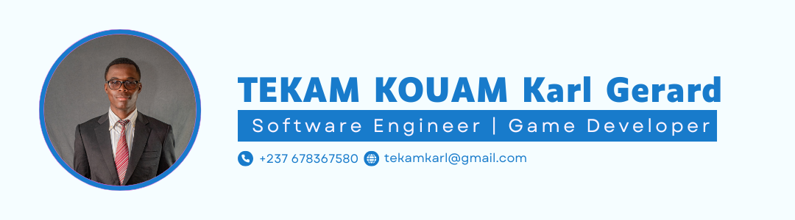

# Hi there,👋 #

 
  

 

<h3> 👨 Karl | 💻 Software Engineer & Game Developer | 🛸 Yaounde, Cameroun </h3>

 

  

<h3 align="left">Talking about Personal Stuff:</h3>

- 🌱 I’m currently working on **mobile games** with Unity and improving my skills in **backend development** using Node.js and Flask.

- 💬 Ask me about anything tech-related, especially **game development**, **web technologies**, and **mobiles technologies**. I'm happy to share insights and help!

- 💻 I love coding, learning new technologies, and building real-world projects.

- 📫 How to reach me: **[Karl](https://www.linkedin.com/in/karl-gerard/)**

 

 
 

[More Info](https://github.com/vn7n24fzkq/github-profile-summary-cards)

# 🚀 Languages, Frameworks, Databases & Game Engines

<table align="center">
  <!-- Languages -->
  <tr>
    <td align="center" width="96">
      
       Java
    </td>
    <td align="center" width="96">
      
       C
    </td>
    <td align="center" width="96">
      
       C++
    </td>
    <td align="center" width="96">
      
       C#
    </td>
    <td align="center" width="96">
      
       Python
    </td>
    <td align="center" width="96">
      
       Git
    </td>
  </tr>

  <!-- Frameworks -->
  <tr>
    <td align="center" width="96">
      
       React
    </td>
    <td align="center" width="96">
      
       Flask
    </td>
    <td align="center" width="96">
     
       Django
    </td>
    <td align="center" width="96">
      
       Node.js
    </td>
    <td align="center" width="96">
      
       Next.js
    </td>
        <td align="center" width="96">
      
       Flutter
    </td>
  </tr>

  <!-- CSS Frameworks -->
  <tr>
    <td align="center" width="96">
      
       Bootstrap
    </td>
    <td align="center" width="96">
      
       Tailwind
    </td>
    <td align="center" width="96">
      
       PostgreSQL
    </td>
    <td align="center" width="96">
      
       Redis
    </td>
    <td align="center" width="96">
      
       Unity
    </td>

  </tr>

  